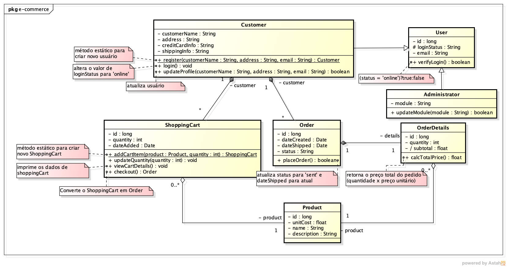

# Prova 1
Implemente em um projeto do Maven o modelo abaixo.

## Critérios de avaliação
 - (**1.0 pontos**) Projeto Maven com coordenadas (br.edu.ifrs.canoas.lpoo2:p1:1.0), identificação do projeto (nome: lpoo2, url: canoas.ifrs.edu.br) e autor, dependências (JUnit 4x e AssertJ) e compilador JDK 8. A estrutura de pacotes do projeto deve respeitar as coordenadas.
 - (**3.0 pontos**) Implementação do modelo descrito
 - (**2.0 pontos**) Teste de Unidade para User, Administrator, Order e OrderDetails (mínimo 2 asserções diferentes por método).
 - (**2.0 pontos**) Teste de Unidade para Customer (mínimo 2 asserções diferentes por método).
 - (**2.0 pontos**) Teste de Unidade para ShoppingCart (mínimo 2 asserções diferentes por método).
 
 **A entrega é exclusiva pelo GITHUB**
